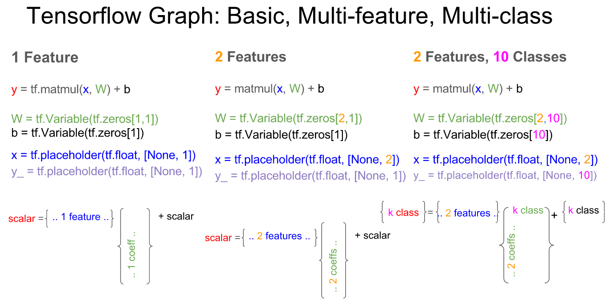

# tensforlow 

标签: 机器学习 TensorFlow

文章主要讲述tensorflow中几个简单的模型

----
[TOC]

## 0. Tensorflow Bases
+ datetype with tensorflow

| 名称 | 类型 | 说明 |
| --- |--- |---- |
| constant | 常量，定义时给出 | tf.constant(2., tf.float32)
|placeholder|占位符，一般用于输入输出，运算前给出，也是程序参数输入的入口|x = tf.placeholder(tf.float32)|
|Variable|变量，可以在运算过程中访问（赋值或者读取）|W = tf.Variable([.3], tf.float32)|


 
## 1. 线性回归（linear regression）

linear regression algorithm helps to predict scores ont the variable `Y` from the scores on the variable `X`. 
[linear regression theoty](https://www.zybuluo.com/irving512/note/761819)


### simple example
```python
# coding:utf-8
import tensorflow as tf
import numpy as np
import matplotlib.pyplot as plt

# parameters
learning_rate = 0.001
training_step = 1000
display_step = 50

# training data 
x_train = np.linspace(-1, 1, 101).astype('float32')
y_train = 2 * x_train + np.random.randn(len(x_train)).astype('float32') * 0.33

train_X = np.asarray([3.3, 4.4, 5.5, 6.71, 6.93, 4.168, 9.779, 6.182, 7.59,
                      2.167, 7.042, 10.791, 5.313, 7.997, 5.654, 9.27, 3.1])
train_Y = np.asarray([1.7, 2.76, 2.09, 3.19, 1.694, 1.573, 3.366, 2.596, 2.53,
                      1.221, 2.827, 3.465, 1.65, 2.904, 2.42, 2.94, 1.3])

# define model y = W*x+b
W = tf.Variable(tf.zeros([1.0]), tf.float32)
b = tf.Variable(tf.zeros([1.0]), tf.float32)

x = tf.placeholder(tf.float32)
y = tf.placeholder(tf.float32)
linear_model = W * x + b

# cost function 
cost = tf.square(linear_model - y)

# training algorythom
train_op = tf.train.GradientDescentOptimizer(0.001).minimize(cost)

# initalize variables
init = tf.global_variables_initializer()
sess = tf.Session()
sess.run(init)

# training
for i in range(100):
    sess.run(train_op, feed_dict={x: train_X, y: train_Y})

plt.figure('Figure1')
plt.scatter(train_X,train_Y, c='b', marker='o')
plt.plot(train_X, sess.run(W) * train_X + sess.run(b))
plt.show()

print (sess.run(W), sess.run(b))
```


#logical regression 